# As expressões regulares são importantes para sempre quando você precisa determinar padrões de textos, encontrar padrões em strings, as regex facilitam, como por exemplo variações da mesma palavra, como por exemplo palavras escritas de forma incorreta

# Roteiro

* O que é
* História
* Padrões
* Caracteres
* Exemplos
* Python + regex

#### O que são expressões regulares?

* Método formal de especificar um padrão de Texto |
  * São padroes para descrever string
* Notação para representar padrões em strings
* Composição de simbolos, caracteres e funções especiais, que, agrupados com caracteres formam uma expressão
  * metacaracteres que formam patterns de texto que especificam como uma string deve ser

#### História

* 1943: Funcionamento dos neorônios
  * Uma galera da neuciencia começou uma pesquisa para saber como funciona os neurônios e com reconhecimento de padrões neurologicos, eles chegaram num sistema que temos como base na regex
* 1968: no qed -> ed -> grep
  * qed um dos prim eiros editores com um campo de busca como um ctrl+f
  * ed um dos primeiros editores do unix
  * grep global regular expression pattern
    * ls -l | grep ago -> mostra os documentos que tem em agosto
* 1986: Regex (Clang) -> "ce-lang"

USE: `https://regexpal.com` [Regex Tester - Javascript, PCRE, PHP](https://www.regexpal.com/)

#### Caracteres [0]

| META / CARACTERES ESPECIAIS | FAZ O QUE?                    |                                                                                                                                                                                                                                                                          |
| --------------------------- | ----------------------------- | ------------------------------------------------------------------------------------------------------------------------------------------------------------------------------------------------------------------------------------------------------------------------ |
| .                           | Qualquer caractere            | 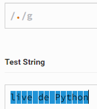 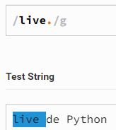 Isso que define um pattern                                                                                                             |
| []                          | lista de caracteres           | 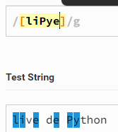 Recupera inclusive caracteres repetidos                                                                                                                                                                 |
| ?                           | anterior pode existir ou não | Usado caso a palavra esteja escrito errado, por exemplo, pode ser que o caractere exista ou pode ser que também não exista 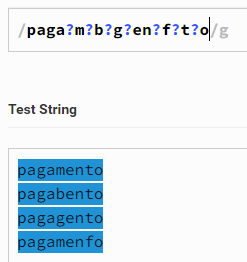 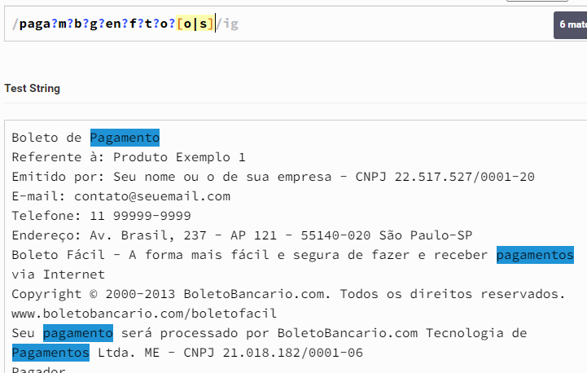 |
| .*                          | qualquer coisa                | 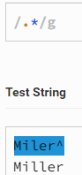                                                                                                                                                                                                              |
| {x}                         | anterior aparece x vezes      | 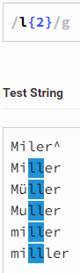                                                                                                                                                                                                              |
| $                           | Fim da linha                  | 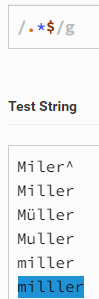 Qualquer coisa que aparece no final do texto                                                                                                                                                            |
| +                           | Anterior ao menos uma vez     | 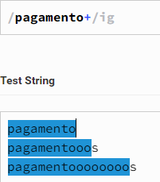 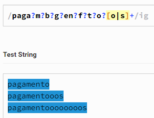                                                                                                                                             |
| (xy)                        | Cria grupos                   |                                                                                                                                                                                                               |
| ^                           | Começo da linha              | 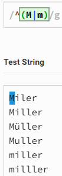 Só pegou o primeiro porque é o único na primeira linha                                                                                                                                               |
| \                           | Escapa o meta                 | 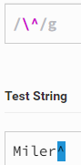                                                                                                                                                                                                              |
| pipe                        | OU                            |                                                                                                                                                                                                                                                                          |
| [^]                         | Lista negada                  |                                                                                                                                                                                                                                                                          |
|                             |                               |                                                                                                                                                                                                                                                                          |
|                             |                               |                                                                                                                                                                                                                                                                          |
|                             |                               |                                                                                                                                                                                                                                                                          |
|                             |                               |                                                                                                                                                                                                                                                                          |

Exemplo:

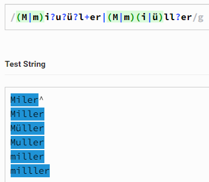

#### Listas

Existem padrões posix

| META         | O QUE FAZ                       | EXEMPLO                                                     |
| ------------ | ------------------------------- | ----------------------------------------------------------- |
| [0-9]PIPE\d  | Acha todos os números          | 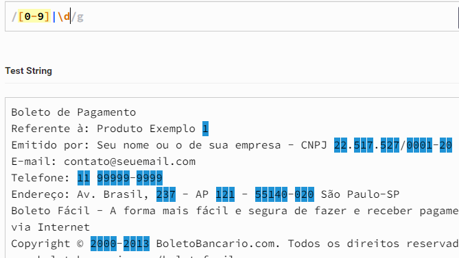 |
| [a-z]        | acha todas as letras minusculas | 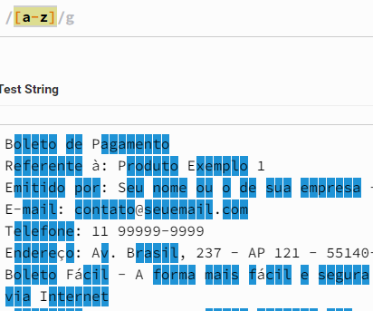 |
| [^0-9]pipe\D | Acha tudo que não seja número | 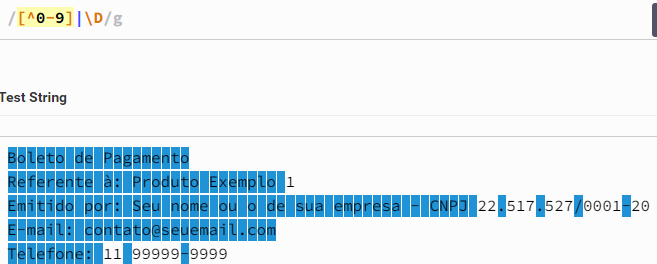 |
| \W           | Acha tudo se não seja letra    | 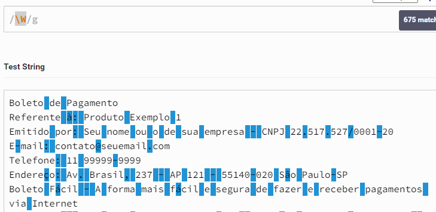 |

Match não individual 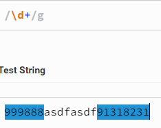

| col1 | col2                            | col3                                                        |                                                                                                                            |
| ---- | ------------------------------- | ----------------------------------------------------------- | -------------------------------------------------------------------------------------------------------------------------- |
|      | Recuperar um numero de telefone | 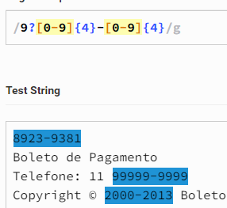 | Pega o 9 no inicio se existir, pega de 0 até 9 que tenham 4 ocorrencias depois um traço depois do 0 ao 9 que  |
|      |                                 |                                                             |                                                                                                                            |

#### Python + Regex = re

* Objetos
  * Um catadão de funções e constantes
* Métodos
  * objetos com regex compiladas e que apresentam alguns métodos

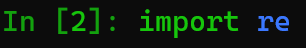

##### Objetos

* Compile
  * Compila uma expressão e a aplica a várias strings
    * Posso armazenar o padrão em uma var e buscar o padrão em muitas strings. Vai compilar a expressão, e a cada string que quiser compilar isso, ele vai funcionar 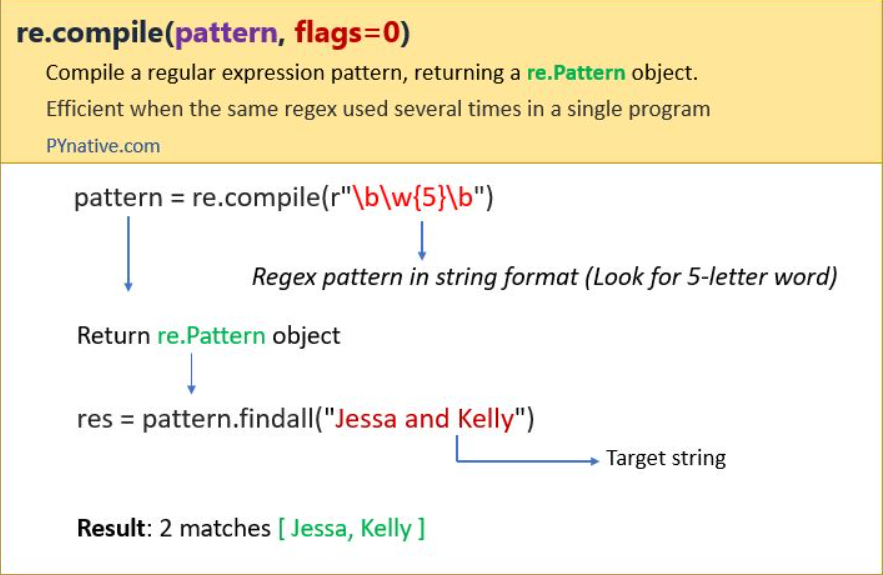
* Search
  * Procura uma expressão em qualquer posição de uma string
    * Como um operador de in 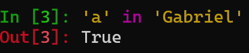
    * 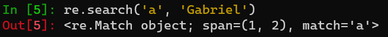
    * Span mostra que está na posição 1 até a 2 na string
* Match[0] / Fullmatch[1]
  * Procura por uma expressão no inicio de uma string (startswith)
    * 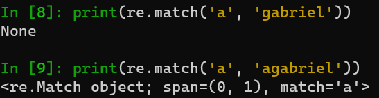
  * Procura uma expressão exatamente igual
    * 
* Split
  * Dada uma expressão, fatia os dados (divide os dados)
    * Split do python
      * 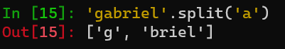
    * com re.split
      * 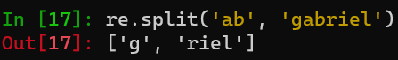
      * 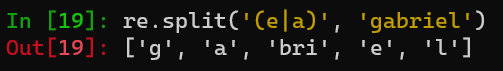

##### Objetos [1]

* Findall

  * Retorna uma lista com todos os matchs encontrados
    * 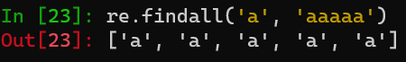
    * 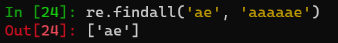
    * 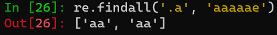
* Finditer

  * Retorna um gerador com todos os matchs, cada um sendo um novo objeto de match

##### Métodos

* search
* match
* fullmatch
* findall / finditer
* **groups**
* **pattern**

### Exemplos:

* Pegando várias palavras:
  * 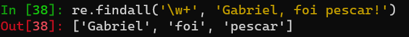
  *
